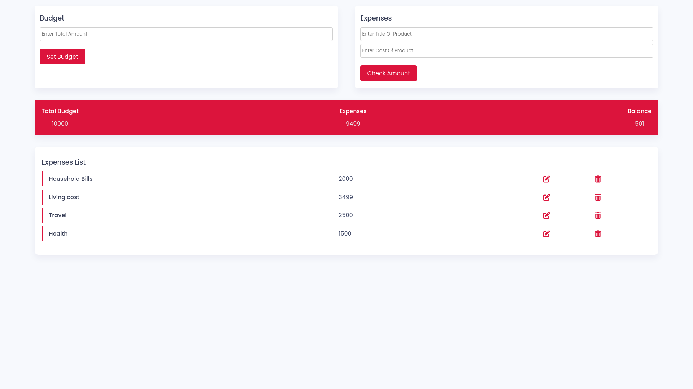

# Simple Budget App

This is a simple budget app that allows you to set a budget and track your expenses. It provides a user-friendly interface to input expenses and displays the total budget, expenses, and balance.

## Preview

## Features

- Set a total budget amount
- Add expenses with a title and cost
- View the total budget, expenses, and balance
- Edit or delete expenses from the list

## Technologies Used

- HTML
- CSS
- JavaScript

## Usage

1. Open the `index.html` file in a web browser.
2. Enter the total budget amount in the "Enter Total Amount" input field and click the "Set Budget" button.
3. Enter the title and cost of an expense in the respective input fields and click the "Check Amount" button to add it to the list.
4. The total budget, expenses, and balance will be updated accordingly.
5. To edit an expense, click the edit button (pencil icon) next to it in the list. Make the necessary changes and click the "Check Amount" button to update the expense.
6. To delete an expense, click the delete button (trash can icon) next to it in the list.
7. The expenses list will display all the added expenses.

## Author

This project was created by Aymane Sadiki.

GitHub: [AymanSdk](https://github.com/AymanSdk)
